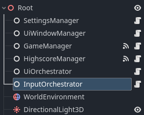

# Input orchestration in Godot
<sup>Published on: %{date-published}%</sup>

Handling input in Godot is not that difficult. You can use the `_input` method or the Input class. It all depends on your needs. You will encounter situations where you sometimes want to block input for some nodes and allow it for others. In this article I will show how this can be achieved.

In the game I'm making, I use so called game states. A couple of game states are PLAYING and PAUSED. When a game state is activated certain UI scenes are also activated and certain input actions are allowed. For example, when game state PLAYING is activated, the score should be shown in the top left corner, player movement should be allowed, and the ESC key should trigger game state PAUSED. When the game state PAUSED is activated, a pause menu should be shown and the ESC key should do two things: close any sub menus and eventually return to game state PLAYING.

The way I achieved this is by introducing something I call an orchestrator. This is basically a class which knows when certain nodes need to handle input and when not. It knows this by keeping tabs on the current game state. If a game state is activated, the input for the configured nodes is activated and for all others it's disabled. The benefits of this class are that you avoid tight coupling and that you eventually can configure this without touching any code.

Three classes are involved:
- **GameState.gd**: A simple enum which contains all available game states.
- **GameStateInput.gd**: Represents a resource which we can use in the Godot editor to configure for which nodes to enable input processing when the configured game state is activated.
- **InputOrchestrator.gd**: Keeps tabs on the current game state, then searches for a GameStateInput which has the activated game state configured, and eventually disables input for all nodes except the configured nodes in the found GameStateInput.

GameState.gd
```gdscript
class_name Enums

enum GameState {
	MENU = 0,
	PREPARE = 1,
	PLAYING = 2,
	PAUSED = 3,
	GAME_OVER = 4,
}
```

GameStateInput.gd
```gdscript
extends Resource

@export var game_state: Enums.GameState
@export var input_nodes: Array[NodePath]
```

InputOrchestrator.gd
```gdscript
class_name InputOrchestrator
extends Node

@export var game_state_inputs: Array[GameStateInput]

var enabled_input_nodes: Array[NodePath]

func on_game_state_changed(state: int):
	_allow_input(state)
			
func _allow_input(state: Enums.GameState):
	enabled_input_nodes = []
	
	for gsi in game_state_inputs:
		if state == gsi.game_state:
			for input_node in gsi.input_nodes:
					var node = get_node(input_node)
					print(node.name + " input enabled.")
					node.set_process_input(true)
					enabled_input_nodes.push_back(input_node)
		else:
			for input_node in gsi.input_nodes:
				if not enabled_input_nodes.has(input_node):
					var node = get_node(input_node)
					print(node.name + " input disabled.")
					node.set_process_input(false)
```
The InputOrchestrator has an export variable where we can configure which nodes should be able to handle input when a specific game state is active. Once the game state changes (`_on_game_state_changed`) the InputOrchestrator goes through all configured game states and determines for which game state to enable input. I'm sure the algorithm can be optimized, but for the moment it gets the job done.

First, we need to attach the InputOrchestrator.gd script to a node. I usually add them as a direct child of the root node. Once the script is attached, we can configure the InputOrchestrator.



Now, we can configure everything in Godot without using code. Here is an example of how I have configured my InputOrchestrator.


You can use this to enable/disable input processing for any kind of nodes, not just UI. In the image above I'm using it to enable input for GameManager and the MovementHandler nodes.