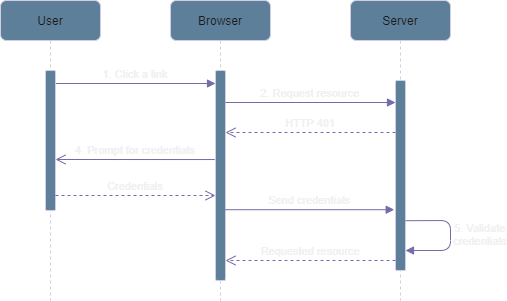

# Basic authentication with Spring Boot and Angular
<sup>Published on: %{date-published}%</sup>

The problem with basic authentication and AJAX calls is that the `WWW-Authenticate` BASIC header triggers the credentials input dialog in the browser. This will happen if you don't sent a valid session cookie or the actual credentials in the `Authorization` header. In this article we will discuss a way to bypass it.

## How does basic authentication work?



1. The user clicks on a secure link.
2. The browser requests the resource from the server. Since the resource is protected, the server will look for the `Authenticate` header. The server can also accept a session cookie if it is configured to do so. If one of the two is not present, the server will respond with an HTTP 401. In that response the `WWW-Authenticate` header is included. This header must include one or more challenges. In our case the challenge will be BASIC. A challenge indicates the authentication scheme to be used to access the secure resource.
3. If the authentication scheme is BASIC, the browser will prompt the user for credentials. This is usually a simple dialog where the user can enter their username and password. This is default behavior for almost every browser. In SPA applications this is usually something you do not want.
4. Once the user has entered their credentials, the browser will now re-send the request (see 1), but now with credentials. This is done using the `Authenticate` header. If the authentication scheme is BASIC, the credentials will be encoded as Base64 and included in the header. For example: If our credentials are test-user and test-password, we then first need to concatenate them like so: `test-user:test-password`. Next, we need to encode them with Base64. The encoded string looks like this: `dGVzdC11c2VyOnRlc3QtcGFzc3dvcmQ=`. The header eventually looks like this: `Authenticate: Basic dGVzdC11c2VyOnRlc3QtcGFzc3dvcmQ=`.
5. The server will now validate the credentials and might issue a session cookie (if it is configured to do so). The server will now return an HTTP 200 with the requested resource.

## Avoiding the credentials popup

So, now that we know that `WWW-Authenticate: BASIC` header in a response triggers the browser to show te popup, we can figure a way around it. The solution is quite simple. On the server-side we just need to adjust the response to not return BASIC. We can instead use our own authentication scheme. For example: XBASIC. The browser will not recognize XBASIC and thus will not show the credentials popup. This gives us the opportunity to handle the login ourselves.

Create a custom AuthenticationEntryPoint and name it `XBasicAuthenticationEntryPoint`. This is what it should look like:

```java
public class XBasicAuthenticationEntryPoint implements AuthenticationEntryPoint {
    private String realmName;

    public void setRealmName(String realmName) {
      this.realmName = realmName;
    }

    public String getRealmName() {
      return realmName;
    }

    @Override
    public void commence(HttpServletRequest request,
                         HttpServletResponse response,
                         AuthenticationException authException) throws IOException, ServletException {
        response.setHeader("WWW-Authenticate", "XBASIC realm=\"" + this.realmName + "\"");
        response.sendError(HttpStatus.UNAUTHORIZED.value(), HttpStatus.UNAUTHORIZED.getReasonPhrase());
    }
}
```
Then we configure our custom entry point as our entry point in Spring security.

```java
...
.httpBasic(conf -> {
    var entryPoint = new XBasicAuthenticationEntryPoint();
    entryPoint.setRealmName("your-realm");
    conf.authenticationEntryPoint(entryPoint);
})
...
```
From our Angular client we still send the `Authenticate` header with `BASIC` as our authentication scheme. If we use `XBASIC` the Spring Boot security filter will not recognize `XBASIC` as a valid authentication scheme and will not proceed with the authentication.

```javascript
  login(credentials: Credentials): Observable<boolean> {
    const encodedCredentials = StrUtils.toBase64(`${credentials.username}:${credentials.password}`);
    const httpOptions = Object.assign({}, this.httpOptions);
    httpOptions.headers = httpOptions.headers.append('Authorization', `BASIC ${encodedCredentials}`);

    return this.httpClient
      .get<User>('/auth', httpOptions)
      .pipe(
        switchMap(user => {
          this._user = user;
          return of(this._user !== null);
        })
      )
      .pipe(catchError(error => {
        if (error instanceof HttpErrorResponse) {
          let httpErrorResponse = error as HttpErrorResponse;

          if (httpErrorResponse.status === 401) {
            throw ErrorMessage.ERR_BAD_CREDENTIALS;
          }
        }

        throw ErrorMessage.ERR_UNKNOWN;
      }));
  }
```
That's it. The credentials dialog will not appear anymore. This solution can also be used with other client side frameworks, not just Angular. I'm using Angular as an example here, because this was actually an issue I ran into while developing an Angular application.